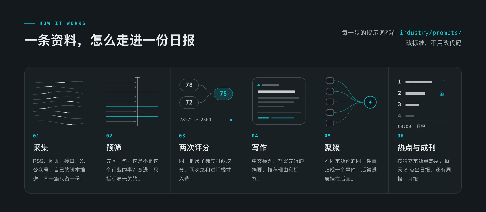
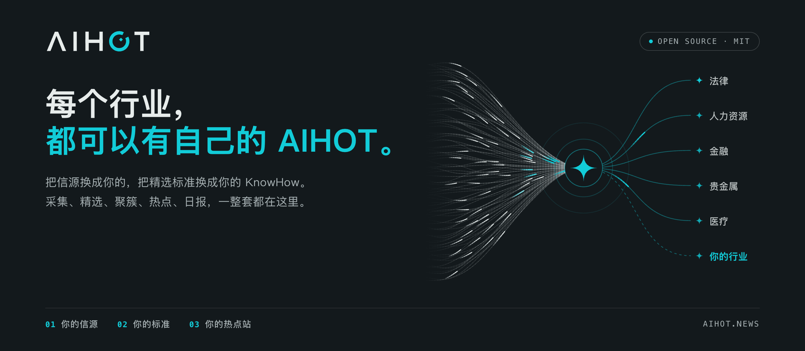

[AIHot](https://aihot.news/)是知名博主[数字生命卡兹克](https://x.com/Khazix0918)做的一个 AI 热点新闻聚合网站。这是据我所知中文里做得最好的 AI 新闻聚合站。国外也有类似的新闻聚合，但是高质量的都是需要收费的。然而 AIHot 既没有收费服务，网站也没有广告，纯纯做成了慈善。属实是当代普罗米修斯了。

更加有趣的是卡兹克说他没有任何编程基础，整个网站都是利用 AI 构建。更意外的是卡兹克还无私把项目[开源在 github](https://github.com/KKKKhazix/AIHOT)。加上我对这种新闻聚合网站实现也比较好奇，所以我花了几个小时看了一下项目源码，把一些发现和想法分享出来。

## 良心真开源

这是我看项目时的第一个想法。因为很多项目虽然代码是开源的，但是是没有文档的。所以个人要理解整个项目的代码库要花费相当多的精力。或者有的项目干脆就没打算让其他人跑起来。现实就是很多项目不会有很清晰的文档，有一些项目知识是隐性地存在开发人员的脑子里。

AIHot 这个项目代码库的分层很清晰，文档也很清晰！完全算得上是高质量开源。从文档可以看出卡兹克是希望其他人真的把这个项目跑起来、用起来的。项目文档都放在 docs 目录下。任何人看了项目的 readme 和 docs 下的文档，都能对项目的架构有清晰的了解。

我必须再次感慨这个项目的结构分层和每个代码文件的职责划分、命名都非常清晰。因此在了解了架构设计后，要修改和查找相关功能的代码是非常容易的。

## 技术选型与架构

整个项目是个 monorepo，前后端都在一起。是一个 TypeScript 全栈项目。因为主体是个网站，这个选型也是非常 AI 友好的。

整个项目分三块：

### 网页端

路径：`apps/web/`。使用 React Router 构建，支持服务端渲染（SSR）。因为是个内容型网站，没什么用户交互。所以没用 Next.js 是个正确的选择。
数据库用的是 PostgreSQL，支持 RLS。如果图省事其实是可以网页服务端渲染的时候直接读数据库的。不过现在服务端渲染的时候数据不是直连数据库获取，而是统一通过 API 访问。统一读 API 读的好处是 web 和后端完全隔离。因为还开放了 API 给第三方读取，这样架构也比较统一。

### API

路径：`apps/api/`。使用 Fastify 构建。
这里我推测应用的初始形态是个单机应用，所以没有考虑边缘部署。未来如果要考虑支持全球的伸缩，可以改为使用 Hono 框架部署到 Cloudflare 的 Worker 上。不过这个网站都是中国用户用，目前也用不上这样的架构。
这层虽然已经是后端，但是这层里没有数据库处理的代码。数据库的读写都统一封装在`packages/backend/`里。

### Worker：pg-boss

基于 pg-boss 任务队列和定时任务。主要是定时抓取信源，然后对信源进行处理，最后存入数据库。
看到任务队列没有使用常见的 BullMQ 我还挺意外的。不过因为数据库已经用了 PostgreSQL，使用 pg-boss 也是一个很务实的技术选型了。这个选型的隐性代价是任务队列与业务数据共用数据库资源：任务量上来后，要关注连接数、表清理、磁盘 I/O，以及对业务查询的影响。

## 六种采集信源

新闻聚合第一步就是采集多个渠道的信源。项目支持六种渠道的信源采集：

- RSS。用 Undici + fast-xml-parser，自己实现 RSS 字段解析。
- 网页采集。基础的网页爬虫 Undici + Cheerio，获取 HTML 后用 CSS 选择器获取内容。如果获取失败用 Jina Reader（收费）。
- JSON 接口。可以自定义内容的返回字段。
- 推特（x），使用第三方 [SocialData](https://x.com/Khazix0918) 的服务，比官方的便宜。$0.2/1000 条。
- 微信公众号。使用第三方极致了（Dajiala），不过这个也不便宜。实时查询账号的文章列表一次要 0.14 元。
- 自己信息集成，提供了一个 POST 接口。

这套项目已经覆盖了常见的公开互联网内容采集方式：RSS、网页列表、JSON 接口、特定平台的数据服务，以及外部脚本推送。

如果想扩展采集能力，可以在网页采集这块加入 Playwright 等浏览器自动化方案，处理需要执行 JavaScript、点击或滚动才能加载内容的页面。
不过这些采集方案的技术门槛其实都不高，真正费心的还是信源本身——要找到足够优质、且能长期维护的信源。采集和处理也都不是免费的：有些渠道按次收费，每篇文章再经大模型处理又是一笔开销，信源数量一多，成本会很快叠加上去。所以这套系统能不能高效运营，核心还是看能不能找到高质量信源，并且在数量上取得平衡。

## 亮点：文章处理流程



对采集到的文章怎么筛选评分是这个项目里的亮点。这里面的处理流程也是 AI 大放异彩的地方。项目里专门有一篇[文档](https://github.com/KKKKhazix/AIHOT/blob/main/docs/selection.md)来介绍如何进行分析处理。

预筛（prefilter）、文章打分、写标题摘要、结构化标签提取、同一主题判断（聚簇归组）都借助了 AI 的处理。

这个文章的处理工作流的设计非常优秀，值得借鉴学习。

第一步的预筛不评判文章质量，只判断是否和行业有关。输出 3 个选项：pass、block、unknown。

这里面给文章打分的流程是个优秀的设计。一方面提示词的打分角度很优秀，另一方面多少分算精选是一个变量，未来如果需要调整改起来也很方便。

后面根据文章生成摘要，结构化标签是很常规的 AI 应用了，不再多说。

### 聚簇归组

聚簇归组的流程也挺有意思。比如 GPT 发布了新模型的新闻，同一个事件不同的媒体都会报道，所以把它们归到一个事件下就很有必要。项目里的处理方式是取标题、摘要，生成文本向量。从最近 14 天发现的已归组报道中找相似内容。接着让模型比较新闻和已有内容，最后判断新闻是加入已有事实、事件新进展还是新建事件。让我意外的是向量的查询对比没有使用向量数据库，也没有使用辅助库。是纯手写的处理逻辑。

这也是我后面要讨论的一个 AI 时代下新的可维护性标准改变的例子。一般程序员会优先使用成熟的技术方案，即便引入某些框架会加重项目复杂度。可能引入的一个库有 10 个功能，但是我们其实只用了 1 个功能。不过当下因为 AI 对成熟技术方案的代码实现非常得心应手，所以完全可以根据自己的需求生成代码。可维护性非常高。比如前端组件库，传统的时代会考虑引入 Bootstrap、Ant Design 这样的封装好组件库。当下会优先使用 shadcn 这种 copy-code 方案，因为 AI 完全有能力自己维护代码。

### 优秀提示词：如何给文章打分

如何判断一篇新闻的阅读价值是一个难题。我如果要求每个人回答，肯定都会有一个自己的回答。那么今天来看看此时最强的模型 fable 给出的回答。
核心的判断标准是这篇新闻值得读者花多少注意力。同时还要标定出目标读者是关注 AI 的重度用户、产品经理、创业者和轻度开发者。
评分分三步：

1. 识别事件：谁做了什么，目前是预告、测试、上线、开源还是已经完成；只认材料支持的事实。
2. 判断类型：模型发布、产品上线、工具技巧、研究论文、行业事件、观点分析、教程解读。
3. 五个维度各打 0–10 整数分，再按类型加权，得到 0–100 分。

这是五个打分维度：

1. `sig` 实质份量：它在 AI 时间线上是节点、这周值得知道的变化，还是当天脚注。不要把“普通人能马上用”重复算进这一轴。

2. `nov` 信息增量：材料带来了多少明确的新认知，而不是标题看起来有多新。具体新能力、新结果、新事实、新方法或新矛盾才是增量。

3. `cred` 证据强度：材料内部对核心事实提供了多强的支持，不是来源名气。官方公告足以证明“宣布、上线、降价、开源”这一动作，但不能自动证明宣传中的效果。

4. `reson` 共振面：多少读者会觉得与自己有关，或至少能理解它为何重要、反常、好玩。

5. `act` 可用性：读者是否能马上使用、学习、调整选择或迁移做法。纯新闻和重大事件的 act 低是正常的，不应反过来抹掉 sig。

同时还配了一个权重矩阵，不同类型新闻在这五个维度上的权重还有所调整。不同类型有不同偏重：模型发布偏实质份量；产品、工具和教程偏可用性；论文偏实质份量与信息增量；行业事件偏共振面与实质份量；观点偏共振面与信息增量。

它的主要取舍是：
**重视真实变化**：广泛开放的能力升级、通用智能体框架开源、可复用方法，以及 AI 带来的重要现实结果。
**压低日常噪声**：普通小更新、空泛 PR、无实质内容的预告、无证据的惊叹、推广和狭窄技术微创新；部分情形明确限制相关维度的最高分。
事件与稿件分开看：短文、转述、引用不自动扣分；大厂、名校、长文、术语和数字多也不自动加分。
**强事件不能被弱叙事掩盖**：正式广泛发布不能因为稿件像转发，就当成个人体验；通用框架开源不能因为附带案例，就当成客户 PR。
不替材料补故事：标题与正文核心明显不符，或残缺到无法识别事件，最终不超过 30 分。
最终严格按权重计算，不额外奖励、不凑整、不迎合精选门槛，只输出 {"attentionScore": 整数}。
再补充一个产品细节，因为大模型天然输出有波动性，为了保证打分的严谨系统还让同一个模型独立进行了两次打分取平均值。很良心了。

## 自定义二次开发



那么把这个开源项目改为你想要的行业热点站难吗？
首先这个开源项目是仁至义尽了，已经是知无不言了。项目里已经配置好了 Docker，所以把第一步把它运行起来不需要任何编程基础，有 AI 就行。
第二步其实就有点难度了，就是 readme 里的副标题“把信源换成你的，把精选标准换成你的 KnowHow，它就是你的行业热点站”。
我认为一个“情报”系统有两个核心：

1. 定义高质量的信息源
2. 定义什么是好信息

这两者都很看品味和行业判断力。
这两个模块的修改都不涉及代码。无论是在项目里提前配置好信息源，还是跑起来以后自己手动通过网站后台添加很容易。文章筛选、打分标准的提示词是文本，改起来也没难度。

但是我觉得普通人很难一上来就知道行业的优质信息源都有哪些，以及如何判断信息的质量。当然可以摸索了，但是肯定不是那种几分钟就能构建好的。

如果完成了前面两步，那么第三步对这个现有系统进行改造难度是比较低的。如果是纯外行，还是需要不少耐心。因为大概率你要的行业系统和它现在的 AI 类新闻不同，需要用 agent 做一些改造。如果是程序员维护这个系统还是比较容易上手的。

另外如果你的信息源涉及推特、微信公众号还是要给第三方聚合平台掏一点钱的，每篇新闻处理好几个地方都用到了大模型，也需要一些 token。一个月信息处理的成本花个几十、几百还是有可能的。看你加多少数据源。

## AI 时代下的“可维护性”

现在我想讨论一个新话题：AI coding 下的软件工程。这个项目提供了一个很好的例子：一个不懂代码的人，利用顶级 AI 能否做出一个生产级的软件。毫无疑问这个项目做到了。虽然“代码”不存在了，但是软件工程还是存在的。看项目代码的时候能看出来很多地方的代码没有人类痕迹，但是架构和类级别的抽象还是很符合人类的优秀软件工程实践。

软件项目里程序员的注意力可以彻底离开代码实现了。生产关系适应生产力，程序员需要适应 coding agent 这个新生产力。

这让我想起历史上铝的一段故事。19 世纪的时候因为没有好的工艺，铝是非常稀有的贵金属，价值和黄金一样。拿破仑三世尤其喜欢，宫廷里最顶级的餐具全是铝餐具，次一级的是白银餐具。民间的认知是“科学家竟然从普通泥土一样的矿物里，炼出了一种银白色、不会轻易锈蚀、而且极轻的新金属（silver from clay）。”后来生产工艺提升，铝成为了一个非常平民化的金属。**我想这就是现在代码的价值的变化，会写代码本身不是一个有价值的事了**。我个人的绝望感知点是 GPT 5.6 Sol，这个版本的代码防御性非常强。我正常写代码肯定不会考虑这么多的边缘情况。因此工作的重点已经变成如何让它写出我们想要的代码了，也是另一种层面上的 harness。

当一个项目里所有的代码都是 AI 写的时候，软件工程里代码的可读性、可维护性也就发生了改变。最近知名程序员 Uncle Bob 也有类似的观点，他说他现在已经不看 AI 写的代码了，在社区也是引起了广泛的讨论。

这个项目里有很多代码的实现属于对于人类不太友好，但是对于 AI 是高效的做法。比如我拿项目里获取新闻详情的接口的代码举例（[detail.ts](https://github.com/KKKKhazix/AIHOT/blob/main/packages/backend/src/publication/detail.ts)）：

```js
/**
 * Public detail (rules.hasItemPage): items the lists leave out (low relevance, merged duplicates, no
 * Chinese summary yet) keep a noindex page; withdrawn and hot_signal items are a 404.
 */
export async function loadItemDetail(id: string, now = new Date()): Promise<DetailResult> {
  const row = await loadRow(id);
  const summary = toItemSummary(row);
  const related = await sql<StoryRef[]>`
    SELECT DISTINCT st.public_id::text AS "publicId", st.title
    FROM fact_articles fa JOIN facts f ON f.id = fa.fact_id JOIN stories st ON st.id = f.story_id
    WHERE fa.article_id = ${id} AND fa.role <> 'mention' AND st.merged_into IS NULL
    LIMIT 6`;

  let body: ItemDetail["body"] = null;
  let outline: OutlineEntry[] = [];
  if (row.channel === "x") {
    const text = String(row.x_post?.text ?? row.body_text ?? "");
    body = {
      zh: summary.x?.translation ? textToHtml(summary.x.translation) : null,
      original: text ? textToHtml(text) : null,
      zhKind: summary.x?.translation ? "translation" : null,
      complete: true,
    };
  } else if (row.body_mode === "full" && row.body_html) {
    const isZh = row.language === "zh" || (/[一-鿿]/.test(row.body_text?.slice(0, 400) ?? "") && row.language !== "en");
    const original = proxyBodyImages(row.body_html);
    const zh = isZh ? original : row.tr_html ? proxyBodyImages(row.tr_html) : null;
    const primary = withOutline(zh ?? original);
    outline = primary.outline;
    body = {
      zh: zh ? primary.html : null,
      original: zh && !isZh ? withOutline(original).html : isZh ? null : primary.html,
      zhKind: isZh ? "original" : zh ? "translation" : null,
      complete: isZh ? true : row.tr_complete ?? false,
    };
  }

  let group: ItemDetail["group"] = null;
  if (row.fact_id) {
    const [g] = await sql<{ public_id: string; reports: number; sources: number }[]>`
      SELECT f.public_id, count(p.article_id) AS reports, count(DISTINCT p.source_id) AS sources
      FROM facts f JOIN publications p ON p.fact_id = f.id
      WHERE f.id = ${row.fact_id} AND p.visibility = 'public' AND p.eligible AND (NOT p.selected OR p.visible_after <= ${now})
      GROUP BY f.public_id`;
    const [dev] = await sql<{ n: number }[]>`
      SELECT count(DISTINCT other.id) AS n FROM facts f
      JOIN facts other ON other.story_id = f.story_id AND other.id <> f.id
      JOIN publications p ON p.fact_id = other.id
      WHERE f.id = ${row.fact_id} AND f.story_id IS NOT NULL AND ${selectedCondition(now)}`;
    if (g) {
      group = {
        factId: g.public_id,
        story: summary.story,
        reportCount: Number(g.reports),
        additionalSourceCount: Math.max(0, Number(g.sources) - 1),
        developmentCount: Number(dev?.n ?? 0),
      };
    }
  }

  const detail: ItemDetail = {
    ...summary,
    readingMode: "full",
    author: row.author,
    language: row.language,
    body,
    outline,
    relatedStories: related,
    indexable: row.indexable,
    markdownAvailable: markdownAvailable(row),
    group,
  };
  return { kind: "found", detail, row };
}
```

这个上面的实现，从人类的角度肯定不是一个好实现。如果是我 review，我会要求修改。主要有两个问题：1.单个函数实现太长。2.代码的抽象层级不在一个层级，在业务逻辑里混入了更低层级的数据库操作（是的，项目里没用 ORM，都是手写 SQL）。这个函数的关注点太多了。

可是“兰博，战争已经结束了。”

虽然这样的代码对人类读起来有点费力，但是依然在 AI 的舒适区，它可以在一个函数里承受更高的复杂度。代码都在一块可能还易于它修改。程序员可以关注类和更高层级代码的设计、约束。

## 最后

铝的故事还有后半段。铝变便宜之后，它没有从历史里消失，反而成了造飞机的材料。莱特兄弟 1903 年那台发动机的曲轴箱，用的就是铸铝。材料便宜了，值钱的变成了拿它造什么、怎么造。
